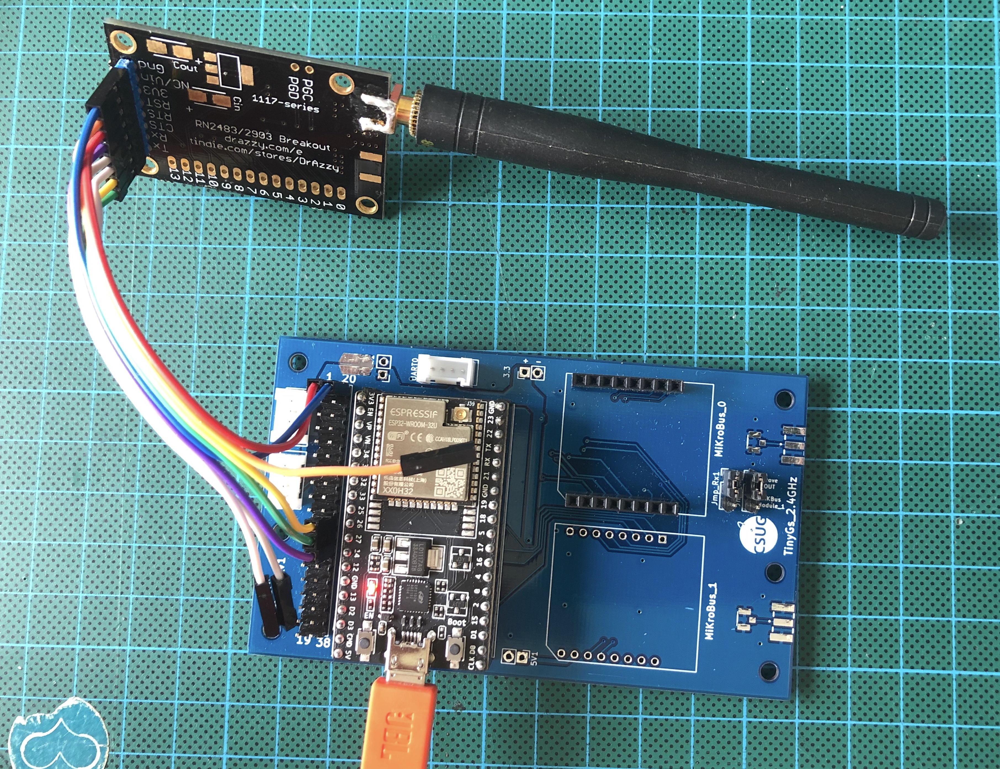

# Simple LoRaWAN example with RN2XX3 LoRaWAN modem and ESP32 Wroom 32

[RN2483-Arduino-Library](https://github.com/jpmeijers/RN2483-Arduino-Library) should be installed using the Library manager of the Arduino IDE.

On ESP32 Wroon 32, Serial2 pins are 16 for RX and 17 for TX.

Connect:
* Pin 16 (RX) should be plugged on TX pin of the RN2XX3 modem.
* Pin 17 (TX) should be plugged on RX pin of the RN2XX3 modem.
* Pin 4 should be plugged on RST pin of the RN2XX3 modem.
* Pin 3.3V should be plugged on 3V3 pin of the RN2XX3 modem.
* Pin GND should be plugged on GND pin of the RN2XX3 modem.

Then register the endpoint with its DevEUI, AppEUi and AppKey on your favorite LoRaWAN Network Server (TTN, Helium, Chirpstack on premise).

## TODO
* [ ] add support for region EU433, CN470, US915
