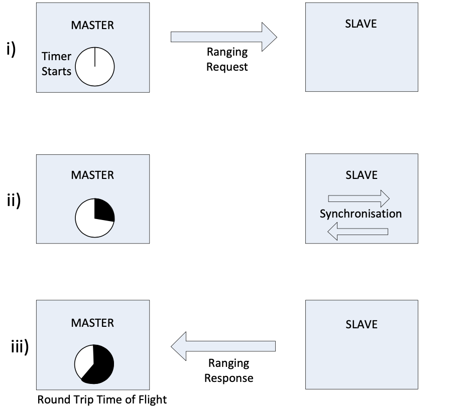

# Basic ranging tests with SX1280 modules of the TinyGS 2G4 station

The test are based on the Arduino library for SX12XX https://github.com/StuartsProjects/SX12XX-LoRa

## Basic operations

Read [ranging.md](ranging.md) and [Semtech, Application Note: An Introduction to Ranging with the SX1280 Transceiver](https://semtech--c.na98.content.force.com/sfc/dist/version/download/?oid=00DE0000000JelG&ids=06844000005gpO1AAI&d=%2Fa%2F44000000MDiH%2FOF02Lve2RzM6pUw9gNgSJXbDNaQJ_NtQ555rLzY3UvY&operationContext=DELIVERY&viewId=05H2R000002XSa6UAG&dpt=)

The ranging functionality of SX1280 is based upon the measurement of a round trip time of flight between a pair of SX1280 transceivers. This process uses the LoRa modulation scheme so the ranging benefits from all of the advantages of long range and operation at low consumption conferred by LoRa. The basic ranging operation is outlined in the sequence below:



1. One SX1280 assumes the role of Master and initiates a ranging exchange by transmission of a ranging request. The ranging request is addressed to another SX1280, which must be configured in ranging Slave mode, so ready to receive the incoming ranging request. At the moment that the Master sends the ranging request, it also starts an internal timer.
1. The ranging request is received by the addressed Slave, which synchronizes itself with the incoming signal. The Slave does not know at which time the signal was set, but the synchronization process requires a fixed amount of time known by the Master. Master and Slave never share a common absolute timing reference.
1. Finally the Slave sends the synchronized ranging response back to the Master, upon reception of which the Master can deduce the round-trip time of flight from the time elapsed i.e. the time taken for the electromagnetic wave to propagate from Master to Slave and back again.


## Instructions

### Ranging Slave

Build and flash `54_Ranging_Slave.ino` on the first board.

The UART console of the slave shows the ranging requests and responses 
```
451 Response sent
452 Response sent
453 Response sent
454 Response sent
455 Response sent
```

> Hint: You can power the slave board with USB power pack for the experiments.

### Ranging Master

Build and flash `55_Ranging_Master.ino` on the second board.

```
TEST #74
Start Ranging ...
Valid,Register=528,Distance=23.8m,RSSIReg=109dBm,RSSI=-41dBm
Start Ranging ...
Valid,Register=437,Distance=19.7m,RSSIReg=94dBm,RSSI=-56dBm
Start Ranging ...
Valid,Register=480,Distance=21.6m,RSSIReg=109dBm,RSSI=-41dBm
Start Ranging ...
Valid,Register=529,Distance=23.8m,RSSIReg=92dBm,RSSI=-58dBm
Start Ranging ...
Valid,Register=449,Distance=20.2m,RSSIReg=111dBm,RSSI=-39dBm

Test=74,TotalValid=5,TotalErrors=0,AverageRAWResult=484,AverageDistance=21.8m

```

## References

* [Semtech, Theory and Principle of Operation: Advanced Ranging, Technical Report, February 2021](https://lora-developers.semtech.com/uploads/documents/files/TheoryAndPrinciples_AdvancedRanging_SX1280_v7.pdf)
* [Semtech, Application Note: An Introduction to Ranging with the SX1280 Transceiver](https://semtech--c.na98.content.force.com/sfc/dist/version/download/?oid=00DE0000000JelG&ids=06844000005gpO1AAI&d=%2Fa%2F44000000MDiH%2FOF02Lve2RzM6pUw9gNgSJXbDNaQJ_NtQ555rLzY3UvY&operationContext=DELIVERY&viewId=05H2R000002XSa6UAG&dpt=)
* [P. Müller, H. Stoll, L. Sarperi and C. Schüpbach, "Outdoor Ranging and Positioning based on LoRa Modulation," 2021 International Conference on Localization and GNSS (ICL-GNSS), 2021, pp. 1-6, doi: 10.1109/ICL-GNSS51451.2021.9452277.](https://digitalcollection.zhaw.ch/bitstream/11475/22769/3/2021_Mueller-etal_Outdoor-ranging-and-positioning-based-on-LoRa-modulation.pdf)
* [Firefighter indoor localization (POUCET)](https://www.researchgate.net/publication/336346405_Firefighter_indoor_localization_POUCET)

