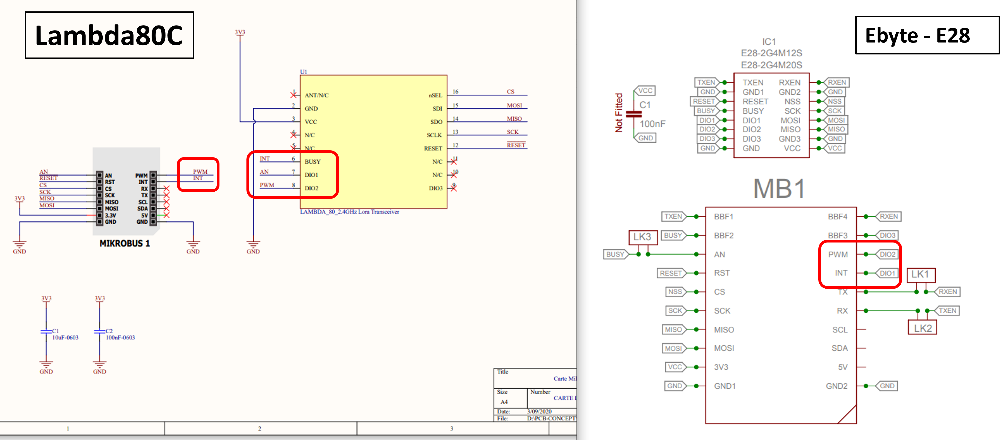
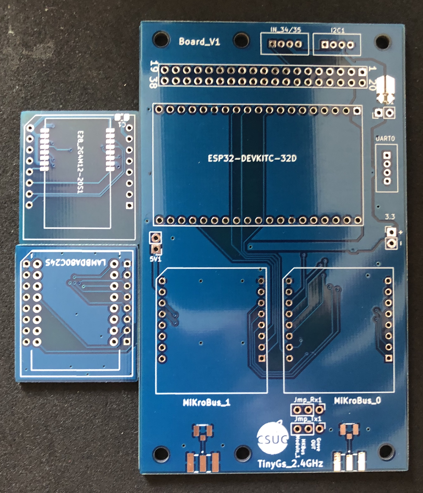
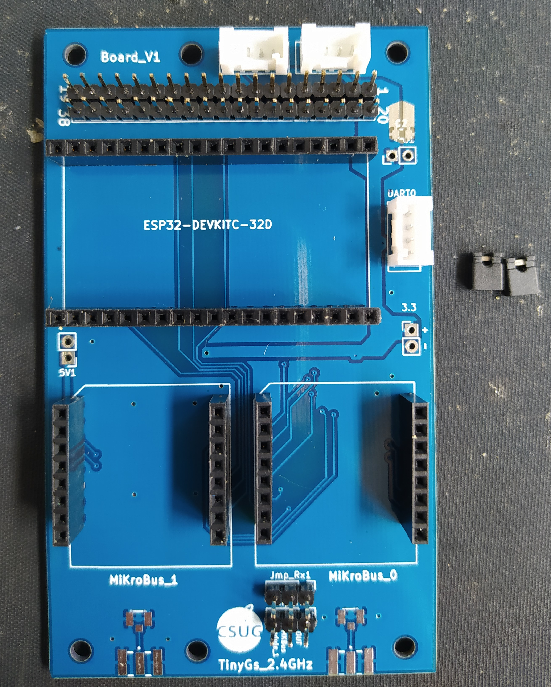
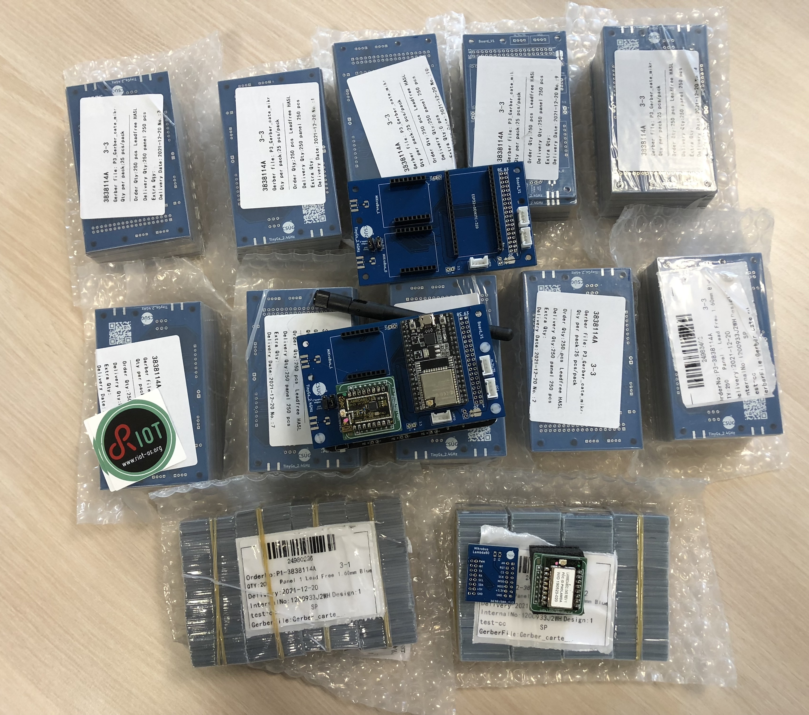
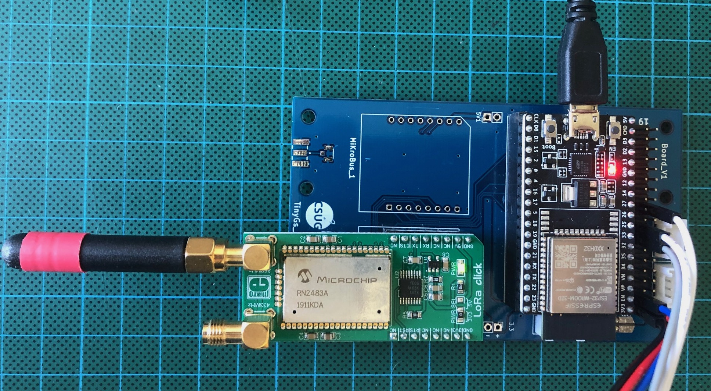
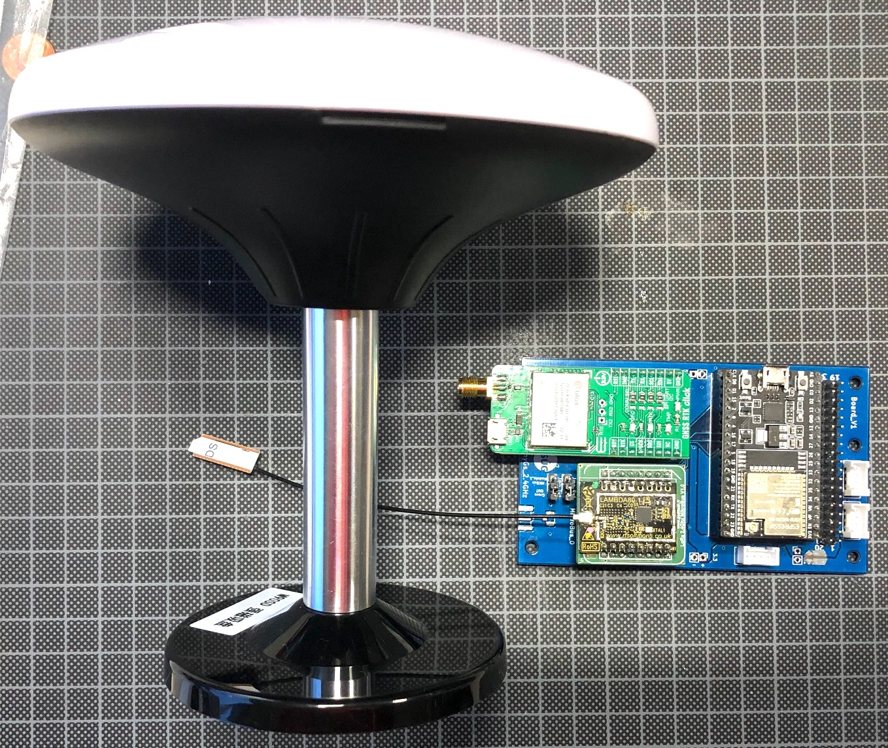
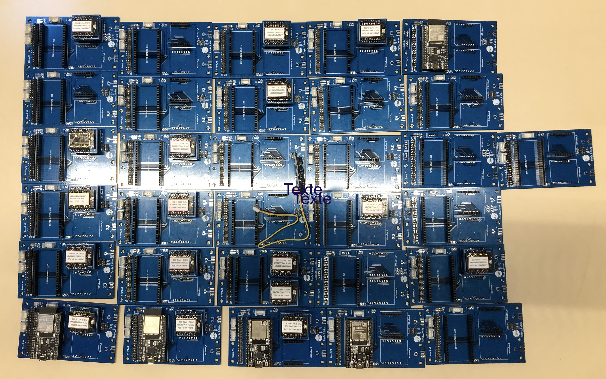

# TinyGS :: 2.4 GHz LoRa (low cost and low tech) ground station

Project to develop a ground station board that will receive messages from satellite on the 2.4GHz band. Satellite tracks are [Thingsat@STORK1](https://tinygs.com/satellite/ThingSat) and other cubeseat followed by the TinyGS community. This station is low cost (off the shelves boards and modules) and low tech (required only a solder iron).

This Git contains Hardware and software of a TinyGS 2.4 GHz LoRa ground station https://tinygs.com/.


## ESP32 Wroon 32U

The default MCU board is the [ESP32 Wroom 32U](https://www.espressif.com/sites/default/files/documentation/esp32-wroom-32d_esp32-wroom-32u_datasheet_en.pdf).

> Remark: The ESP32 Wroom 32D (on board PCB antenna) and The ESP32 Wroom 32U (UFL connector for an mandatory external antenna) can be used.

## SX1280 modules

For the long-range communication, we will use the Semtech SX1280, which is a low power 2.4 GHz LoRa RF Transceiver.

Several manufacturers provide RF modules integrating the SX1280 transceiver :
* [Lambda80 module](https://fr.farnell.com/rf-solutions/lambda80-24s/transceiver-2mbps-2-5ghz/dp/2988571)
* [EByte E28 module](https://www.amazon.com/Ebyte-%C3%89metteur-r%C3%A9cepteur-Bluetooth-E28-2G4M12S-%C3%A9metteur/dp/B07P2BZW5C)
* [SX1280PATR24 module](https://fr.aliexpress.com/item/1005001598235704.html) 
* [Miromico FMLR STM SX1280 module](https://miromico.ch/portfolio/fmlr-8x-x-stlx/?lang=en)
* [NiceRF LoRa1280 module](https://www.nicerf.com/products/detail/2-4ghz-lora-wireless-transceiver-module-lora1280-lora1281.html)
* [NiceRF LoRa1280-TCXO module](https://www.nicerf.com/products/detail/2-4ghz-range-measurement-wirelessly-long-distance-module-lora1280-tcxo.html)
* [NiceRF LoRa1280F27-TCXO module](https://www.nicerf.com/products/detail/500mw-2-4ghz-lora-wireless-transceiver-module-lora1280f27-tcxo.html)
* [Embit EMB-LR1280S](http://www.embit.eu/products/wireless-modules/emb-lr1280s/)

Project contains several PCBs and firmwares. 

##  Main Board

PCB are made to integrate up to 2 Mikrobus modules including SX1280 technology. Mikrobus board is an add-on board socket standard made by [mikroe](https://www.mikroe.com/mikrobus). This makes the ground station adjustable and modular.
 

There are 2 different PCB version:
* Board_Tinysgs_2.4GHz_V1, which contains: ESP32 Wroom 32 + 2 Mikrobus modules + Grove connectors (RXTX,I2C,ANA)
* Board_Tinysgs_2.4GHz_V2, which contains: ESP32 Wroom 32 + 2 Mikrobus modules + Grove connectors (RXTX,I2C,ANA) + H-Bridges for driving stepper + Power supply

We made the board as modular as possible. It is possible to implement all modules as desired, as long as it respects the Mikrobus pin specification. Mikrobus module are connected by SPI, I2C, UART and more GPIO. They are both supplied by 3V and Mikrobus_1 is also supplied by 5V if desired. 2 SMA connector mount edge are available on board. Theyre a connected to a SMA male connector, which allows to plug any signal that we want through a SMA female connector.

Both Mikrobus boards are connected to the ESP 32 by SPI. They are using the same SPI bus (SPI_0).

PCB are made on [KiCad](https://www.kicad.org/), which is a free software for electronics circuit board design. PCBs has been manufactered by [JLCPCB](https://jlcpcb.com/).

##  Power

A [Power Bank NCR18650B Battery shield](https://www.amazon.com/Diymore-Lithium-Battery-Charging-Arduino/dp/B07SZKNST4) made for Arduino and ESP32 can be plugged under the board using the 4 screw holes.

##  Mikrobus adapters for SX1280 modules

The design of two Mikrobus adapters for SX1280 modules are currently provided by the project.

The pinouts of [Lambda80 SX1280 module adapter](./Mikrobus_Board_Lambda80C/) and the [EByte E28 SX1280 module adapter](./Mikrobus_Board_EbyteE28/) have some differences.

> Two versions of the E28 module exists: 12S & 20S

```
E28 module
AN  <-> Busy
INT <-> DIO1
PWM <-> DIO2

Lambda80C module
AN  <-> DIO1
INT <-> Busy
PWM <-> DIO2
```



##  Other Mikrobus adapters for SX1280 modules

* [ ] [Geditech](https://www.geditech.fr/)'s LoRa SX1280 adapter
* [ ] [Stuart Robinson's (GW7HPW) Breadboard Friendly Board for NiceRF SX1280 Module](https://www.tindie.com/products/stuartsprojects/breadboard-friendly-board-for-nicrf-sx1280-module/)
* [ ] [Stuart Robinson's (GW7HPW) Breadboard Friendly Board for Ebyte E28 Module](https://www.tindie.com/products/stuartsprojects/breadboard-friendly-board-for-ebyte-e28-module/)

## Other Mikrobus modules (for the second Mikrobus slot)

Have a look into the [shop](https://www.mikroe.com/shop)

* [ ] [Geditech](https://www.geditech.fr/)'s LoRa Microchip RN2483 (for 433 MHz and 868 MHz ISM bands)

## Firmware

Firmware are into [./Firmware](./Firmware).

## Off-the-shelves gateways for LoRa 2.4 GHz

Those gateways had 3 LoRa® 2.4GHz channels for Rx and 1 LoRa® 2.4GHz channels for Tx.

* [Multitech MTCDT + MCard MTAC-LORA-2G4-3](https://www.multitech.net/developer/software/lora/mtac-lora-2g4-3/)
* [SX1280Z3DSFGW1 LoRa® 2.4GHz 3 Channels Single SF Reference Design](https://fr.semtech.com/products/wireless-rf/lora-24ghz/sx1280zxxxxgw1) (included a removable mPCIe card).
* [Embit EMB-FEM2GW-O-2G4](http://www.embit.eu/products/gateways-2/emb-fem2gw-o-2g4/) (included a removable mPCIe card EMB-LR1280-mPCIe-4x).


## References

* [ESP32-DevKitC V4 Getting Started Guide](https://docs.espressif.com/projects/esp-idf/en/latest/esp32/hw-reference/esp32/get-started-devkitc.html)
* [ESP32 Wroom 32 D/U Datasheet](https://www.espressif.com/sites/default/files/documentation/esp32-wroom-32d_esp32-wroom-32u_datasheet_en.pdf)

## Buy

### ESP32 Wroon 32U

* [ESP32-DevKitC-32U @ Aliexpress](https://fr.aliexpress.com/wholesale?SearchText=ESP32+Wroom+32U)
* [ESP32-DevKitC-32U @ Mouser](https://www.mouser.fr/ProductDetail/Espressif-Systems/ESP32-DevKitC-32U?qs=%252BEew9%252B0nqrCEVvpkdH%2FG5Q==)
* [ESP32-DevKit-LiPo @ Olimex](https://www.olimex.com/Products/IoT/ESP32/ESP32-DevKit-LiPo/open-source-hardware)

> **Important: ESP32 Wroon 32U had 38 pins and an UFL connector for an external (high gain and directive) antenna. ESP32 Wroon 32D had 38 pins and a PCB antenna. Choose ESP32 Wroon 32U for a better link margin.**

### SX1280 modules

* [LAMBDA80C-24D @ Farnell](https://fr.farnell.com/rf-solutions/lambda80c-24d/transceiver-2mbps-2-5ghz/dp/2988574?st=lambda80) (UFL connector + EM shield)
* [LAMBDA80C-24S @ Mouser](https://www.mouser.fr/ProductDetail/RF-Solutions/LAMBDA80C-24S?qs=17u8i%2FzlE89dhjIrlJ9FHg%3D%3D) (UFL connector + EM shield)
* [EByte E28-2G4M20S @ Aliexpress](https://fr.aliexpress.com/item/1005001812057589.html) (UFL connector + EM shield)

### PCB

* [Wuerth Elektronik](https://www.we-online.com/web/fr/wuerth_elektronik/start.php) 
* [JLCPCB](https://jlcpcb.com/)

### Headers and connectors
* [20-pin stackable headers (x2)](https://www.mouser.fr/ProductDetail/SparkFun/PRT-14311?qs=sGAEpiMZZMv0NwlthflBiwoz7B0w9MUDoIB50flBSMs%3D) for ESP32 : should be resized to 19 pins.
* [8-pin stackable headers (x2)](https://www.mouser.fr/ProductDetail/SparkFun/PRT-10007?qs=sGAEpiMZZMvShe%252BZiYheitG2EllKzxS98FBwaVjriqQ%3D) for Mikrobus modules.
* [Grove connectors (x3 but optional)](https://www.mouser.fr/ProductDetail/Seeed-Studio/110990030?qs=1%252B9yuXKSi8Dw9fpnq%252BdNzQ%3D%3D).

### Power (Optional)
* [Diymore 2x18650 Battery Pack @ Aliexpress](https://fr.aliexpress.com/item/33016661427.html)
* [DFRobot Solar Power Manager 5V](https://www.dfrobot.com/product-1712.html)
* [DFRobot Solar Power Manager Micro](https://www.dfrobot.com/product-1781.html)
* [Adafruit Universal USB / DC / Solar Lithium Ion/Polymer charger - bq24074](https://learn.adafruit.com/adafruit-bq24074-universal-usb-dc-solar-charger-breakout/design-notes)

### Misc
* [SuperAntennaz](https://wiki.satnogs.org/SuperAntennaz)

## Licenses

For PCB designs, the license is [Attribution-NonCommercial-ShareAlike 4.0 International (CC BY-NC-SA 4.0)](https://creativecommons.org/licenses/by-nc-sa/4.0/).

For Software, check the license into each directory.

## Todolist

* [x] PCB for ESP32 Wroom 32 (38 pins) + 2 Mikrobus modules + 3 groves connectors (RXTX,I2C,ANA)
* [ ] PCB for ESP32 Wroom 32 (38 pins) + 2 Mikrobus modules + 3 groves connectors (RXTX,I2C,ANA) + H-Bridges for driving stepper + Power supply
* [x] Mikrobus adapter for Lambda80 SX1280 module
* [x] Mikrobus adapter for EByte E28 SX1280 module
* [ ] Mikrobus adapter for [SX1280PATR24 module](https://fr.aliexpress.com/item/1005001598235704.html) 
* [ ] Mikrobus adapter for [Miromico FMLR STM SX1280 module](https://miromico.ch/portfolio/fmlr-8x-x-stlx/?lang=en)
* [ ] Mikrobus adapter for [NiceRF SX1280 module](https://stuartsprojects.github.io/2019/10/07/2-4ghz-nicerf-sx1280-lora-balloon-tracker-85km-achieved.html)
* [ ] Mikrobus adapter for [Microchip RN2483 module](https://www.microchip.com/en-us/product/RN2483)
* [ ] Mikrobus adapter for [RF Solutions RF-LORA-868-SO module](https://fr.rs-online.com/web/p/lpwan/9033059)
* [ ] Mikrobus adapter for [Abeeway-Murata Geolocation Module](https://docs.abeeway.com/thingpark-location/B-Feature-Topics/GeolocModule_C/)
* [ ] Mikrobus protoshield
* [x] [Arduino sketches](./Firmware/Arduino/SX1280) for ESP32 Wroom 32 + E28 Mikrobus module
* [x] [Arduino sketches](./Firmware/Arduino/SX1280) for ESP32 Wroom 32 + Lambda80 Mikrobus module
* [ ] [Arduino sketches](./Firmware/Arduino/SX1280) for Wio Terminal + Lambda80 Mikrobus module
* [ ] Move UART Grove connector for using Grove cable with ESP32-WROOM-32D (PCB antenna)
* [ ] TinyGS firmware for ESP32 Wroom 32 + E28 Mikrobus module
* [ ] TinyGS firmware for ESP32 Wroom 32 + Lambda80 Mikrobus module
* [ ] TinyGS firmware for ESP32 Wroom 32 + [Miromico FMLR STM SX1280 module](https://miromico.ch/portfolio/fmlr-8x-x-stlx/?lang=en)
* [ ] TinyGS firmware for ESP32 Wroom 32 + [LR1120 Dev Kit module](https://fr.semtech.com/products/wireless-rf/lora-edge/lr1120dvk1tbks) for such modulations and bands : LoRa SubGHz, LoRa 2.4GHz, LR-FHSS, S-Band (1.9-2.1GHz)
* [ ] TinyGS firmware for [Wio Terminal](https://wiki.seeedstudio.com/Wio-Terminal-Getting-Started/) + Lambda80 Mikrobus module
* [ ] Power consumption study with [X-NUCLEO-LPM01A](https://www.st.com/en/evaluation-tools/x-nucleo-lpm01a.html)
* [ ] RIOTOS firmware for ESP32 Wroom 32 + Lambda80 module (cubesat emulator)
* [ ] Test the [Geditech](https://www.geditech.fr/)'s LoRa Microchip RN2483 (for 433 MHz and 868 MHz ISM bands) on second slot.
* [ ] Add slots for I2C and UART grove connectors into the two Mikrobus slots (can be used when the Mikrobus slot is not used)
* [ ] Add slot for female header in order to plug a low-cost SDCard SPI breakout (useful for data logging)
* [ ] Add slot for female/male header in order to plug a low-cost DS1307/DS3231 breakout (useful for timestamping data log entries)
* [ ] Add extra slot for power sources (3V3, VCC)
* [ ] Add white label for DevEUI and serial number on silkscreen layer
* [ ] Add pin for IRQ on [GNSS PPS](https://en.wikipedia.org/wiki/Pulse-per-second_signal)
* [ ] Design Fritzing part for the station
* [x] add licenses
* [ ] review PCB designs according the [Mikrobus specifications v2.0](https://download.mikroe.com/documents/standards/mikrobus/mikrobus-standard-specification-v200.pdf)


## Media

Here the picture of the board_V1, with or without modules. On last picture, a GPS, a magnetometer and a joystick are connected by grove connection.


Mounted PCB with Grove boards ([Grove Thumb Joystick](https://wiki.seeedstudio.com/Grove-Thumb_Joystick/), [Grove  LSM6DS3 Accelerometer Gyroscope](https://wiki.seeedstudio.com/Grove-6-Axis_AccelerometerAndGyroscope/), [Grove GPS](https://wiki.seeedstudio.com/Grove-GPS/)) and Lamdba80 and E28 module.







